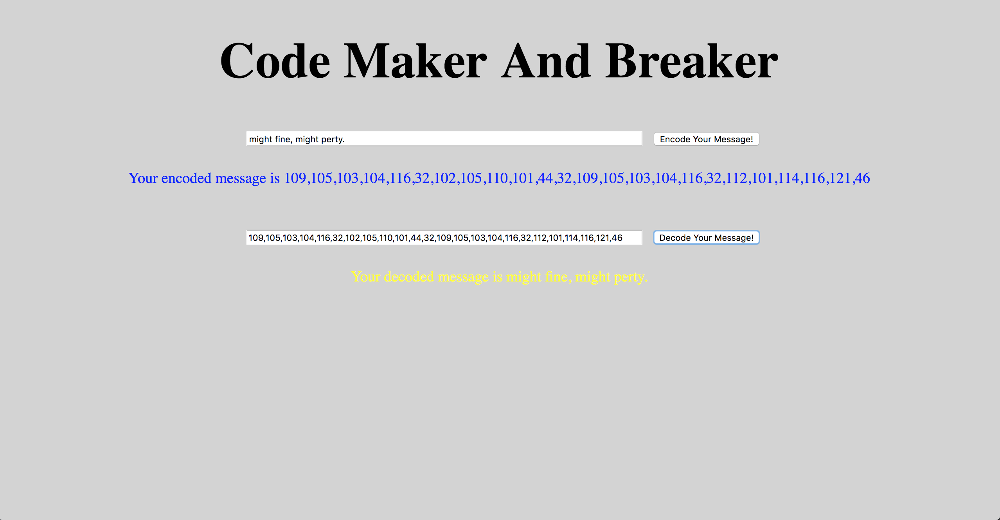

# code-maker-breaker

This is an app that will take text and encode it into a secret. 
The app should also decodes secrets into plain text. 


We were tasked with
* Github project with cards
* Cards should be by feature
* Each card should have its own branch and follow the correct git branching process
* Re-usable functions
* Functions follow single responsibility principle 
* Clean code - proper indentation, comments as needed, no console.logs after merging

##Screenshots




## How to run this project:

* Use nmp to install htpp-server:

```sh

npm install -g http-server

```
* Run the server:

```sh

hs -p 9999

```

* Open Chrome and navigate to:

```

localhost:9999

```
